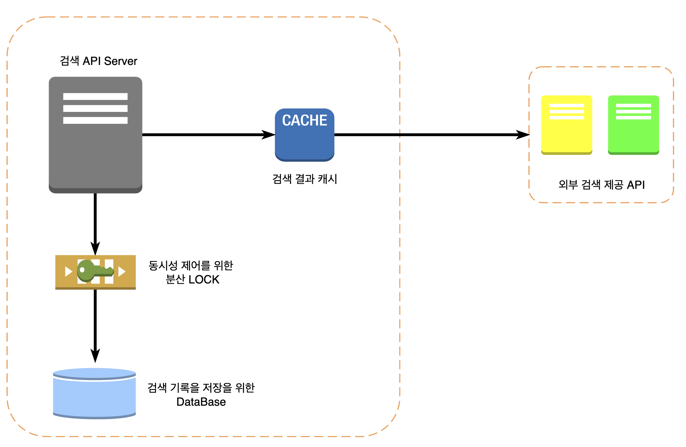
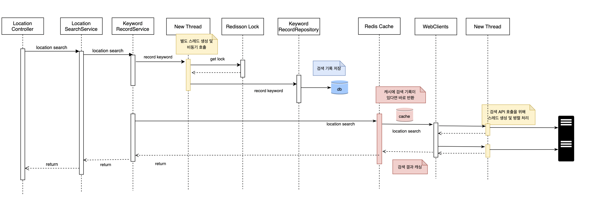
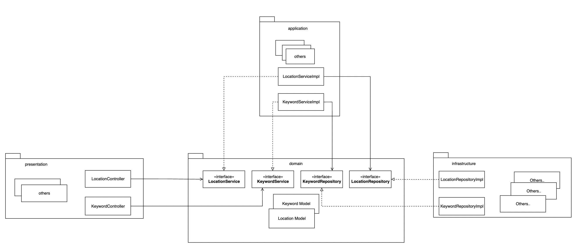

# LOCATION SEARCH API

### 실행 방법

1. 빌드 및 docker-compose 명령어로 실행합니다.

```bash
# boot jar 파일 생성을 위한 빌드 명령어
$ ./gradlew bootJar

# 도커 실행 명령어 - [spring boot app, mysql, redis]
$ docker-compose up -d
```


2. 테스트
   - root 디렉토리 하위의 request_test.http 파일 활용
   - `http://{HOST}:{PORT}/api-docs`접속하여 swagger 활용
      - ex: `http://localhost:8080/api-docs`

---

### 실행 환경

- Docker (docker compose)
    - MySql
    - Rediss
    - Spring Boot Application

---

### 활용 오픈소스

- **DB  접근 기술 : ORM[mysql + spring boot data jpa + hibernate]**
    - 검색 키워드 저장소로 mysql을 사용하고 이에 접근하기 위한 기술로 ORM framework
    (jpa + hibernate)을 활용했습니다.
    MyBatis와 같은 mapper framek와 비교해 유지보수성이 뛰어나고, 무엇보다 OOP
    (도메인 모델 구조)에 적합하기 때문에 선택했습니다.
- **분산 Lock : [redisson]**
    - 동시성 이슈 해결을 위해 분산 Lock 기술을 채택했고 그 구현체로 redisson을 선택했습니다.
    어플리케이션 레벨에서 해결하는 일반적인 동시성 기술이 분산 환경에서 갖는 한계점을 고려하여 선택했습니다.
- **API 클라이언트 : [spring boot webflux]**
    - 외부 API 호출 클라이언트 기술로 webflux를 활용했습니다. 한 개 이상의 API 호출을 했을 때 응답성과 처리량을 고려하면 병렬 호출이 적합하다고 판단했고 이를 지원해주는 webflux를 선택했습니다.
- **캐시** : **[spring boot cache + spring boot data redis]**
    - 동일한 키워드에 대한 검색 결과가 변경되는 시점까지 짧지 않은데, API 호출 시 발생하는 병목 지점을 해결하기 위해 캐시를 선택했고, 분산 환경을 고려하여 redis를 선택했습니다.
- **API Document** : **[springdoc openapi]**
    - API 문서화와 브라우저에서 테스트 가능하게끔 openapi(swagger)를 적용했습니다.
- **기타 : [lombok]**
    - 개발 편의성을 위해 lombok을 사용했습니다. 단, 사이드이펙트 여지가 큰 @Data, @AllArgsConstructor, @RequiredArgsConstructor 등은 배제했습니다.
    

---

### 시스템 아키텍처



### 시퀀스 다이어그램 - 장소 검색



---

## 기술 요구사항 구현

### 동시성 이슈

검색 키워드 횟수 증가에 대한 동시성 문제를 분산 Lock을 활용하여 제어하는 방향으로 설계 적용했습니다.

일반적으로 어플리케이션 코드 레벨에서 동시성을 제어하는 경우 분산 환경에서 적합하지 않고, DB lock에 의존하는 경우 성능 및 과부화 이슈가 존재하는데, redisson은 분산 환경에서도 적합하고 
spin lock 구조가 아니기 때문에 과부화 이슈도 줄어들어 효과적으로 동시성을 제어할 수 있습니다.

<br>

### 대용량 트래픽

- **반응성**
    - 키워드 검색 시, **검색 횟수를 저장**하기 위한 서비스 호출에 대해 별도의 스레드를 생성 및 비동기로 수행하여 검색 결과에 대한 응답성을 개선했습니다.
    - 키워드 검색 시 kakao, naver를 비롯한 **여러 API를 호출**할 때 WebClient를 활용한 멀티 스레딩 병렬 처리로 응답성과 처리량을 개선했습니다.
    - 키워드 검색 시, **결과를 Cache에 저장**(만료 1시간)하여 동일한 검색 키워드에 대해 API 호출을 하지 않고 Cache 결과를 사용하기 때문에 API 호출을 위한 병목 지점을 줄임으로써 반응성을 개선했습니다.
- **확장성 및 가용성**
    - 동기화 처리에 대해 **분산 Lock**을 활용함으로써 분산 확장시에도 문제가 없도록 설계하였습니다.
    - 캐시 처리에 대해 **Redis 저장소**를 활용함으로써 분산 확장시에도 적용 가능하도록 설계하였습니다.

<br>

### 서비스 오류 및 장애 처리

에러 코드와 Exception에 대한 추상 타입을 두고 각 계층에서 상속 및 구현하여 사용할 수 있도록 표준화를 했습니다.

이에 따라 도메인/비즈니스 규칙에 대한 예외, 서비스 호출에 대한 예외, 기술적인 예외 구분과 후처리에 대한 판단이 용이합니다.

<br>

### 새로운 검색 API 제공자 추가 시

템플릿 메서드 패턴을 적용한 추상 타입(ClientMonoBuilder)이 마련되어 **제어의 역전** 특성이 활용됩니다.

LocationWebClients 객체가 빈으로 등록된 모든 ClientMonoBuilder 타입에 대하여 API 호출을 합니다.

이에 따라 새로운 API 제공자가 추가된다면 ClientMonoBuilder를 상속한 뒤 추상 메서드들을 구현하기만 하면 됩니다.

구현 사항 크게 아래와 같습니다.

- 추가된 API 제공자 별 필요한 정보(host, path, header 등) 저장
- 추가된 API 제공자의 응답 결과 Response Body를 LocationsEntities로 파싱

필요한 부분만 구현하면 구체적인 API 호출 구현 사항을 알 필요 없이 상위 템플릿이 적절한 시점에 호출합니다.

<br>

### 지속적 유지보수 및 확장에 용이한 아키텍처

어플리케이션은 4계층 구조로 의존성 역전(DIP)를 적극적으로 활용하여 **domain, application**과 같은 고수준 모듈이 **repository, infrastructure**와 같은 저수준 모듈의 변경으로부터 자유롭도록 설계하였습니다.



- **presentation layer**
    - 사용자에게 요청을 받아 application layer에 요청을 위임하고 결과를 응답합니다. api-doc 등의 요청/응답과 관련된 기술 요소를 구현합니다.
    - 필요한 요청을 위임하기 위해 domain layer에서 제공하는 추상화된 Service에 의존합니다.

- **application layer**
    - 시스템이 사용자에게 제공할 어플리케이션 로직 구현을 담당합니다. 이를 위해 domain layer의 도메인 모델을 사용합니다. 또한 상세 구현(키워드 검색 결과에 필요한 로직 등)을 위해 domain layer에서 제공하는 추상화된 function 등을 구현합니다.
    - 필요한 도메인 객체를 얻기 위하여 domain layer 에서 제공하는 추상화된 Repository에 의존합니다.
- **domain  layer**
    - 비즈니스/도메인 규칙과 관련된 핵심 로직을 수행하는 Keywords, Locations과 같은 도메인 모델이 위치합니다. 또한 각 도메인의 문맥을 위한 인터페이스(Service, Repository, Function 등)를 제공합니다. 외부 저장소, 영속성, 화면 등과 같은 기술 요소에 의존하지 않기 떄문에 
    **스프링, DB 등의 기술 요소에 대한 의존성이 없습니다.**
- **infrastructure layer**
    - 도메인 모델을 저장하거나 가져오기 위해 MySQL, JPA, Cache, WebClient 등과 같은 기술 요소들을 이용하여 구현합니다.
    domain layer에서 제공하는 추상화된 repository를 구현합니다.

위와 같이 각 계층에 대한 역할과 책임을 명확하게 분리하고 고수준 모듈인 domain layer에 대한 의존성 역전으로 DB, Cache, WebClient 등의 영속화 기술이 변경되거나 REST, Batch, TCP 등과 같이 표현 기술이 변경되어도 Domain Layer에서 제공하는 추상화를 구현하기만 하면 쉽게 변경이 가능합니다.
